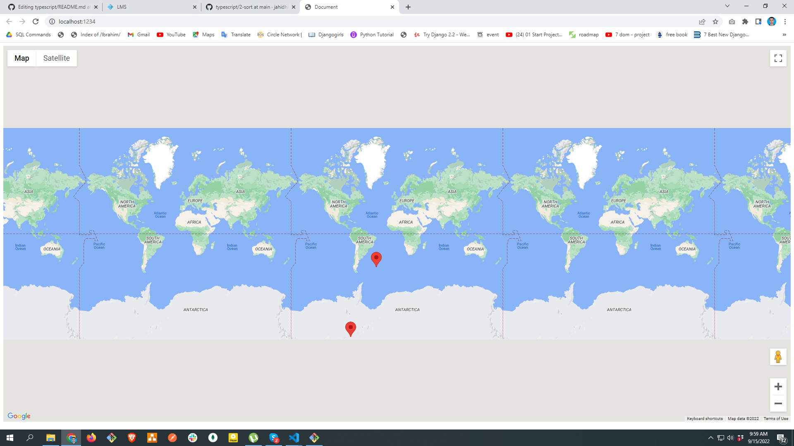

# Google map

# Installation

1. npm install
2. goto index.html at line number 11. Use your own api key

# Run

parcel index.html

# Showcase

##Randomly show map with user and company location

##When a marker is clicked, it's going to show you user information 

##When another marker is clicked, it's going to show you company information

